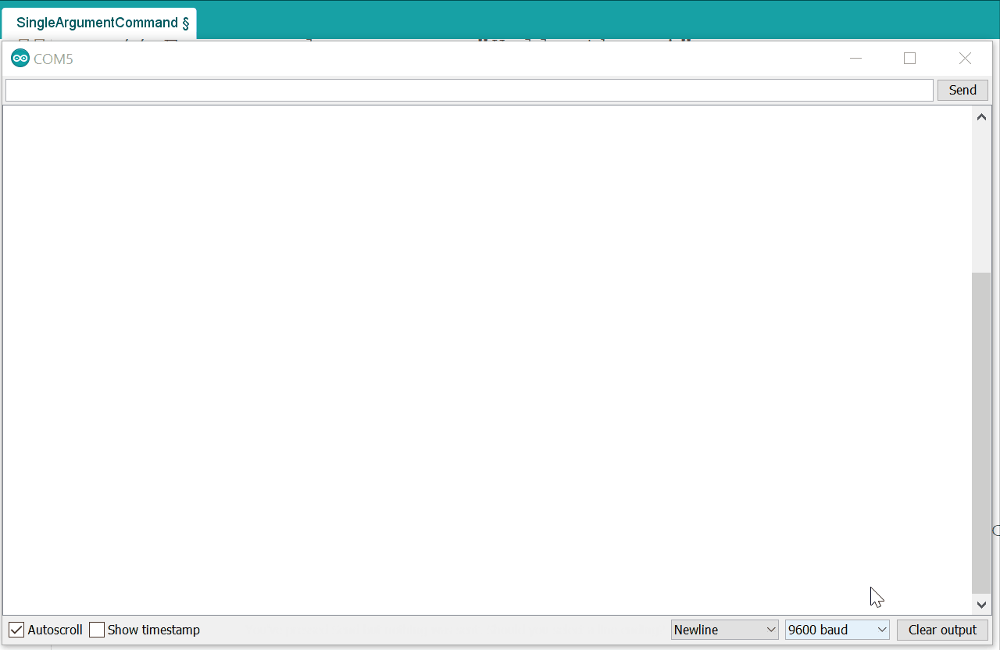
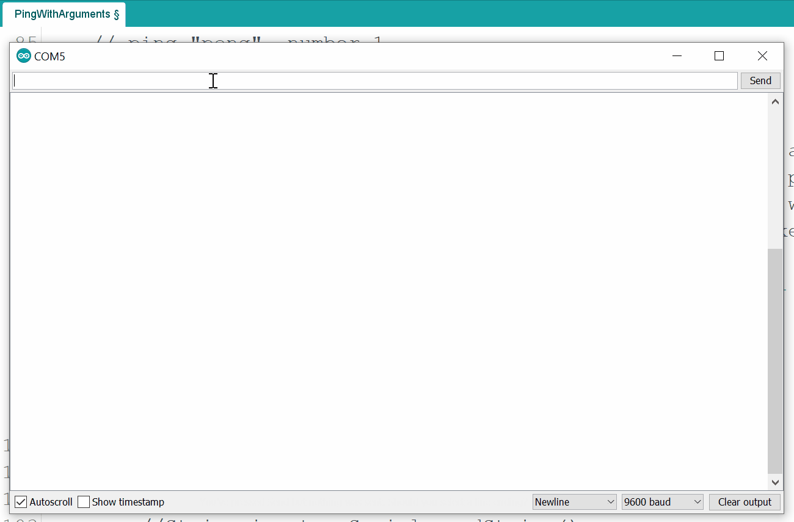

# SimpleCLI

<p align="center"></p>

<p align="center">
<b>A Command Line Interface Library for Arduino!</b><br>
Add commands to your project without hassle.<br>
<br>
<a href="https://www.ardu-badge.com/SimpleCLI" target="_blank"></a><br>
<br>
  🐦 <a href="https://twitter.com/spacehuhn">Twitter</a>
| 📺 <a href="https://www.youtube.com/spacehuhn">YouTube</a>
| 🌍 <a href="https://spacehuhn.com">spacehuhn.com</a><br>
<br>
Support this project and become a patron on <a href="https://patreon.com/spacehuhn">patreon.com/spacehuhn</a>.<br>
Also available: <a href="https://www.tindie.com/products/Spacehuhn/spacehuhn-stickers/">Stickers</a></b>!
</p>

  

## Projects
A list of projects that make use of this library:  
- [The Chicken Man Game](https://github.com/skickar/ChickenManGame)
- [Control ESP32 with Command Line Interface Over the Internet](https://www.hackster.io/donowak/control-esp32-with-command-line-interface-over-the-internet-fa9634)

## Overview

- [About](#about)
- [Supported Devices](#supported-devices)
- [Installation](#installation)
- [Usage](#usage)
  - [Examples](#examples)
  - [Include Library](#include-library)
  - [Create SimpleCLI instance](#create-simplecli-instance)
  - [Adding Commands](#adding-commands)
  - [Adding Commands with callback](#adding-commands-with-callback)
  - [Adding Arguments](#adding-arguments)
  - [Templates](#templates)
  - [Parsing Input](#parsing-input)
  - [Reacting on Commands](#reacting-on-commands)
  - [Reacting on Errors](#reacting-on-errors)
- [Classes & Methods](#classes--methods)
  - [SimpleCLI](#simplecli)
  - [CommandType](#commandtype)
  - [Command](#command)
  - [CommandErrorType](#commanderrortype)
  - [CommandError](#commanderror)
  - [ArgumentType](#argumenttype)
  - [Argument](#argument)
- [License](#license)

## About
The goal of this library is to control your Arduino projects using commands similar to the Linux CLI.  
Because parsing and validating strings in C/C++ can be quite a pain, this library aims to simplify the process as much as possible.  

## Supported Devices
Strings take up a good amount of memory, so **it's strongly recommended to chose a development board with at least 32 KB RAM**.  
It doesn't make much sense to run this library on an Uno or Nano, because it will quickly take up a most of the resources.  
Here's a list of tested hardware (feel free to contribute by making a Pull-Request):  

| Chipset | Board(s) | Flash | RAM | Support |
| ------- | -------- | ----- | --- | ------- |
| ATtiny85 | Digispark | 8 KB | 512 Byte | No! (Does not compile C++11) |
| ATmega328P | Arduino Nano, Arduino Uno | 32 KB | 2 KB | Works for small projects |
| ATmega32u4 | Arduino Leonardo, Pro Micro | 32 KB | 2,560 Byte | Works for small projects |
| ATSAMD21G18 | Arduino MKR WiFi 1010 | 256 KB | 32 KB | Yes! |
| ATSAMD51G19 | Adafruit ItsyBitsy M4 Express | 512 KB | 192 KB | Yes! |
| ESP8266 | NodeMCU, D1 Mini | 512 KB - 16 MB | 80 KB | Yes! |
| ESP32 | DSTIKE D-duino-32 | 1 MB - 16 MB |520 KB | Yes! |

*Some flash and RAM values depend on the development board or module being used.*

## Installation

1) Click [Download Zip](https://github.com/spacehuhn/SimpleCLI/archive/master.zip) to download the source code from GitHub.  
2) Unzip and rename the Folder name to "SimpleCLI".  
3) Paste it in your library folder (usually located somewhere at documents/Arduino/libraries).  
4) Restart the Arduino IDE.  

## Usage

[](https://www.youtube.com/watch?v=UyW-wICdnKo) 

### Examples

Please check out the [example sketches](https://github.com/spacehuhn/SimpleCLI/tree/master/examples/), it's the quickest way to understand how this library works.  
The following sections are for reference.  

  

### Include Library

```c++
#include <SimpleCLI.h>
```

### Create SimpleCLI instance

```c++
SimpleCLI cli;

SimpleCLI cli(COMMAND_QUEUE_SIZE, ERROR_QUEUE_SIZE);
```

`COMMAND_QUEUE_SIZE` and `ERROR_QUEUE_SIZE` are `int`s set to 10 commands and 10 errors by default.  
The oldest command or error will be deleted automatically if the queue gets full.  
You can most likely ignore the queue sizes, as those are just a safety mechanism and won't be important for most use cases.  

### Adding Commands

Command names should only contain upper-, lowercase letters and numbers!  
Recommended are names with only lowercase letters and no numbers.  

```c++
// Normal command with a defined number of arguments
// For example: echo -str "Hello" -n 3
Command myCommand = cli.addCommand("myCommandName");
Command myCommand = cli.addCmd("myCmdName");

// Single-Argument-Command that saves everything after the command name in the first argument
// For example: echo this will be a single string -even with hyphen and in "quotes"
// => "this will be a single string -even with hyphen and in "quotes\"" will be the argument value
Command mySingleArgumentCommand = cli.addSingleArgumentCommand("mySingleArgumentCommandName");
Command mySingleArgCmd = cli.addSingleArgCmd("mySingleArgCmdName");

// Boundless-Command that accepts any amount of arguments separated by spaces
// For example: sum 1 2 3
// => "1", "2", "3" will the argument values
Command myBoundlessCommand = cli.addBoundlessCommand("myBoundlessCommandName");
Command myBoundlessCmd = cli.addBoundlessCmd("myBoundlessCmdName");
```

### Adding Commands with callback

Sometimes it's useful to give the command a callback function that will be executed automatically when the command was entered.  
You must define these callback functions as a global void function with a `cmd` pointer as shown here:  
```c++
void myCallback(cmd* commandPointer) {
  Command cmd(commandPointer); // Create wrapper class instance for the pointer
  // ..
}
```

Now you can create a command and pass it the function pointer:  
```c++
Command myCommand = cli.addCommand("myCommandName", myCallback);
Command myCommand = cli.addBoundlessCommand("myCommandName", myCallback);
Command myCommand = cli.addSingleArgumentCommand("myCommandName", myCallback);

Command myCommand = cli.addCmd("myCommandName", myCallback);
Command myCommand = cli.addBoundlessCmd("myCommandName", myCallback);
Command myCommand = cli.addSingleArgCmd("myCommandName", myCallback);
```

### Adding Arguments

Keep in mind that you can only add arguments to `Command`s and **not** to `SingleArgumentCommand`s and `BoundlessCommand`s.  

```c++
// myCommandName -argumentName "argumentValue"
Argument myArg = myCommand.addArgument("argumentName");
Argument myArg = myCommand.addArg("argumentName");

// Giving the argument a default value, means that the user does not have to specify the argument
// myCommandName
// myCommandName -argumentName "argumentValue"
Argument myArg = myCommand.addArgument("argumentName", "DefaultValue");
Argument myArg = myCommand.addArg("argumentName", "DefaultValue");


// Positional arguments have a certain position and do not have to be named
// myCommandName "argumentValue"
// myCommandName -argumentName "argumentValue"
Argument myArg = myCommand.addPositionalArgument("argumentName");
Argument myArg = myCommand.addPosArg("argumentName");

// Those can also have default values
// myCommandName
// myCommandName "argumentValue"
// myCommandName -argumentName "argumentValue"
Argument myArg = myCommand.addPositionalArgument("argumentName", "DefaultValue");
Argument myArg = myCommand.addPosArg("argumentName", "DefaultValue");


// Flag arguments can either be specified (set) or not, but they don't accept any value
// myCommandName
// myCommandName -argumentName
Argument myArg = myCommand.addFlagArgument("argumentName");
Argument myArg = myCommand.addFlagArg("argumentName");
````

### Templates

With this neat feature, you can give commands and arguments multiple names.  
- A comma (`,`) separates multiple names.  
- A forward slash (`/`) declares everything after it optional (until the next comma, or the end of the string).  

You can combine them together.  

**This means a command or argument name should not use `,` and `/` as a part of the regular name!**  
These characters will always be interpreted as a separator.  

Here are some examples:  

| Name-String | Results |
| ----------- | ------- |
| `a,b,c,d,efg` | `a`, `b`, `c`, `d`, `efg` |
| `ping,pong,test` | `ping`, `pong`, `test` |
| `p/ping` | `p`, `ping` |
| `p/ing/s` | `p`, `ping`, `pings` |
| `p/ing/s,pong` | `p`, `ping`, `pings`, `pong` |
| `p/ing/s,pong/s` | `p`, `ping`, `pings`, `pong`, `pongs` |

### Parsing Input

```c++
// Inline
cli.parse("myCommand");

// From string
String input = "myCommand";
cli.parse(input);

// From serial
String input = Serial.readString();
cli.parse(input);
```

### Reacting on Commands

Be aware that this is only necessary if you have commands that do not have a callback function.  
Callbacks will be run automatically and the command will not wait in the queue.  
```c++
// First check if a newly parsed command is available
if(cli.available()) {

  // Get the command out of the queue
  Command cmd = cli.getCommand();

  // Check if it's the command you're looking for
  if(cmd == myCommand) {

    // Get the Argument(s) you want
    Argument myArgument = cmd.getArgument("argumentName"); // via name
    Argument myOtherArgument = cmd.getArgument(2); // via index

    // Do stuff
    // ...
  }

}
```

### Reacting on Errors

```c++
// Check if a new error occurred
if(cli.errored()) {
  CommandError e = cli.getError();

  // Print the error, or do whatever you want with it
  Serial.println(e.toString());
}
```

You can also make a error callback function, like this one:  

```c++
void errorCallback(cmd_error* e) {
    CommandError cmdError(e); // Create wrapper object

    // Print error
    Serial.print("ERROR: ");
    Serial.println(cmdError.toString());

    // Print command usage
    if (cmdError.hasCommand()) {
        Serial.print("Did you mean \"");
        Serial.print(cmdError.getCommand().toString());
        Serial.println("\"?");
    }
}
```

Just don't forget to add the error callback function to the SimpleCLI instance:  

```c++
cli.setOnError(errorCallback);
```

## Classes & Methods

Here is a plain overview of all classes and their methods:  

### SimpleCLI

```c++
SimpleCLI(int commandQueueSize = 10, int errorQueueSize = 10);

void parse(String& input);
void parse(const char* input);
void parse(const char* input, size_t input_len);

bool available() const;
bool errored() const;

int countCmdQueue() const;
int countErrorQueue() const;

Command getCmd();
Command getCmd(String name);
Command getCmd(const char* name);

Command getCommand();
Command getCommand(String name);
Command getCommand(const char* name);

CommandError getError();

Command addCmd(const char* name, void (* callback)(cmd* c)          = NULL);
Command addBoundlessCmd(const char* name, void (* callback)(cmd* c) = NULL);
Command addSingleArgCmd(const char* name, void (* callback)(cmd* c) = NULL);

Command addCommand(const char* name, void (* callback)(cmd* c)               = NULL);
Command addBoundlessCommand(const char* name, void (* callback)(cmd* c)      = NULL);
Command addSingleArgumentCommand(const char* name, void (* callback)(cmd* c) = NULL);

String toString() const;
void toString(String& s) const;

void setCaseSensetive(bool caseSensetive = true);
void setOnError(void (* onError)(cmd_error* e));
```

### CommandType

```c++
enum class CommandType { NORMAL, BOUNDLESS, SINGLE };
```

### Command

```c++
Command(cmd* cmdPointer = NULL, bool persistent = COMMAND_PERSISTENT);
Command(const Command& c);
Command(Command&& c);

Command& operator=(const Command& c);
Command& operator=(Command&& c);

bool operator==(const Command& c) const;
bool operator!=(const Command& c) const;

operator bool() const;

bool setCaseSensetive(bool caseSensetive = true);
bool setCallback(void (* callback)(cmd* c));

Argument addArg(const char* name, const char* defaultValue);
Argument addArg(const char* name);
Argument addPosArg(const char* name, const char* defaultValue);
Argument addPosArg(const char* name);
Argument addFlagArg(const char* name, const char* defaultValue = "");

Argument addArgument(const char* name, const char* defaultValue);
Argument addArgument(const char* name);
Argument addPositionalArgument(const char* name, const char* defaultValue);
Argument addPositionalArgument(const char* name);
Argument addFlagArgument(const char* name, const char* defaultValue = "");

bool equals(String name) const;
bool equals(const char* name) const;
bool equals(const Command& c) const;

String getName() const;
int countArgs() const;

Argument getArgument(int i = 0) const;
Argument getArgument(const char* name) const;
Argument getArgument(String name) const;

Argument getArg(int i = 0) const;
Argument getArg(const char* name) const;
Argument getArg(String name) const;

CommandType getType() const;

String toString() const;
void toString(String& s) const;

void run() const;
```

### CommandErrorType

```c++
enum class CommandErrorType { NULL_POINTER, EMPTY_LINE, PARSE_SUCCESSFUL,
                              COMMAND_NOT_FOUND, UNKNOWN_ARGUMENT, MISSING_ARGUMENT,
                              MISSING_ARGUMENT_VALUE, UNCLOSED_QUOTE };
```

### CommandError

```c++
CommandError(cmd_error* errorPointer = NULL, bool persistent = COMMAND_ERROR_PERSISTENT);
CommandError(const CommandError& e);
CommandError(CommandError&& e);

CommandError& operator=(const CommandError& e);
CommandError& operator=(CommandError&& e);

bool operator==(const CommandError& e) const;
bool operator!=(const CommandError& e) const;

bool operator>(const CommandError& e) const;
bool operator<(const CommandError& e) const;

bool operator>=(const CommandError& e) const;
bool operator<=(const CommandError& e) const;

operator bool() const;

bool hasCommand() const;
bool hasArgument() const;
bool hasData() const;

bool hasCmd() const;
bool hasArg() const;

CommandErrorType getType() const;
Command getCommand() const;
Argument getArgument() const;
String getData() const;
String getMessage() const;

Command getCmd() const;
Argument getArg() const;
String getMsg() const;

String toString() const;
void toString(String& s) const;
```

### ArgumentType

```c++
enum class ArgumentType { NORMAL, POSITIONAL, FLAG };
```

### Argument

```c++
Argument(arg* argPointer = NULL, bool persistent = ARGUMENT_PERSISTENT);
Argument(const Argument& a);
Argument(Argument&& a);

Argument& operator=(const Argument& a);
Argument& operator=(Argument&& a);

bool operator==(const Argument& a) const;
bool operator!=(const Argument& a) const;

operator bool() const;

bool isSet() const;
bool isRequired() const;
bool isOptional() const;
bool hasDefaultValue() const;

bool isReq() const;
bool isOpt() const;

String getName() const;
String getValue() const;

ArgumentType getType() const;

String toString() const;
void toString(String& s) const;

bool equals(String name, bool caseSensetive       = false) const;
bool equals(const char* name, bool caseSensetive  = false) const;
bool equals(const Argument& a, bool caseSensetive = false) const;
```

## License

This software is licensed under the MIT License. See the [license file](LICENSE) for details.  
